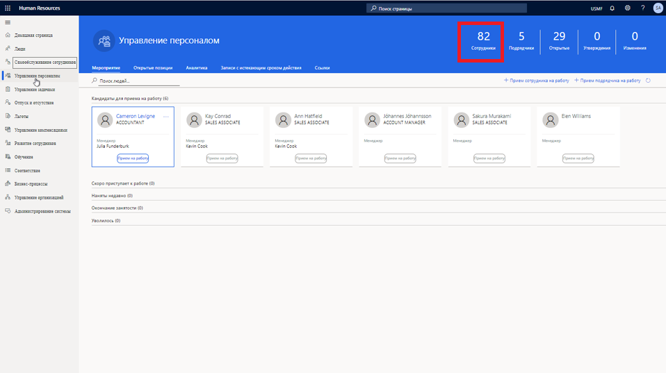

---
demo:
    title: 'Демонстрация 1. Назначение курсов обучения'
    module: 'Модуль 4. Изучение основ Microsoft Dynamics 365 Human Resources'
---

## Демонстрация 1 — назначение курсов обучения

1. Перейдите на домашнюю страницу **Microsoft Dynamics 365 Human Resources**.  
    В приложении Microsoft Dynamics 365 Human Resources руководители по персоналу могут назначать сотрудникам учебные курсы. В этом примере принятой на работу Алисии требуется назначить обучение, доступное для сотрудников в течение их первых тридцати дней работы.

1. Проверьте, чтобы в правом верхнем окне выбора компании, к которой подключаетесь, была указана компания **USMF**. Если это не так, измените компанию на **USMF**.

1. В левом верхнем углу экрана откройте вкладку **Управление персоналом**.

1. В правой части страницы **Управление персоналом** щелкните номер, находящийся непосредственно над словом **Сотрудники**.

    

1. На вкладке **Сотрудники** выберите имя сотрудника, которому назначается обучение. Например, **Alicia Thornber** (Алисия Торнбер).  
    После этого на вкладке «Компетенции и развитие» можно просмотреть ссылки на сведения о сертификатах, образовании и навыках сотрудника.

1. На странице сотрудника откройте вкладку **Компетенции и развитие**.

1. В разделе **Компетенции** выберите пункт **Курсы**.  
    На странице «Курсы» для сотрудника можно увидеть, назначены ли ему (ей) какие-либо курсы. В случае Алисии список курсов пуст. Доступные для назначения курсы можно просмотреть с помощью меню «Код курса».

1. Откройте меню **Код курса**.

1. В таблице курсов откройте меню **Код курса**.

1. В меню **Код курса** выберите пункт **Статус курса**.

1. В меню **Статус курса** выберите пункт **Точный статус курса**.  
    Возможно, потребуется изменить применяемый фильтр **Код курса**, например, для отображения только открытых курсов.

1. В поле **Точный статус курса** введите **Открытый**.

1. В меню **Статус курса** выберите команду **Применить**, чтобы увидеть все доступные открытые курсы.  
    Теперь принятой на работу Алисии можно назначить учебный курс.

1. Выберите курс, который хотите назначить. Например, **00006 Обучение нового сотрудника**.

1. На панели переноса данных курса нажмите кнопку **Да**.

1. На странице **Курсы** в столбце **Дата начала** щелкните **значок календаря**.

1. В календаре выберите дату начала. Например, **5 января 2021**.

1. В столбце **Дата окончания** щелкните **значок календаря**.

1. В календаре выберите дату окончания обучения. Например, **8 января 2021**.

1. В левой части страницы **Курсы** нажмите кнопку **Сохранить**, чтобы сохранить внесенные изменения.

1. В правой части страницы **Курсы** нажмите кнопку **X**, чтобы закрыть страницу.  
    Если требуется изменить какие-либо назначенные курсы, снова выберите пункт «Курсы».

1. На странице **Сотрудник** в разделе **Компетенции** выберите пункт **Курсы**.

1. Чтобы внести изменения, на странице **Курсы** нажмите на панели навигации кнопку **Правка**.

1. В столбце **Дата начала** щелкните **значок календаря**.

1. Выберите новую дату начала курса. Например, **6 января 2021**.

1. Нажмите кнопку **Сохранить**.

1. Нажмите кнопку **X**, чтобы закрыть страницу.

1. На странице **Сотрудник** нажмите кнопку **X**, чтобы закрыть страницу.
