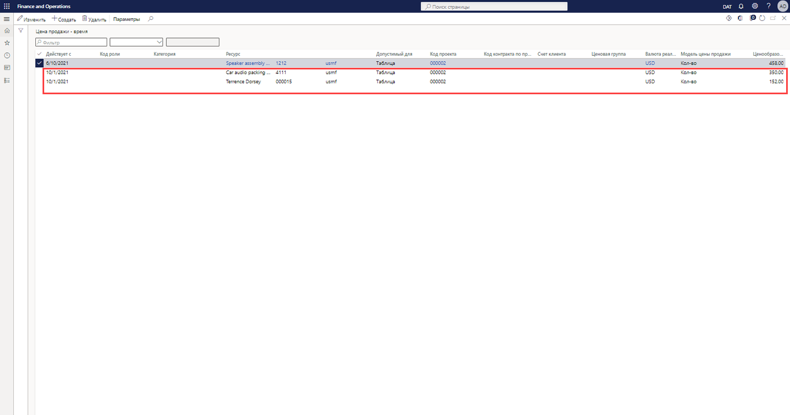

---
demo:
    title: 'Демонстрация 1. Цены операций проекта'
    module: 'Модуль 5. Изучение основ Microsoft Dynamics 365 Project Operations'
---

## Демонстрация 1 — цены операций проекта

1. Перейдите в рабочую область **Управление проектами**.  
    В этой демонстрации будем настраивать в операциях проекта цены продаж и себестоимости. И будет показано, как себестоимость и цены извлекаются из ранее учтенной накладной.

1. Проверьте, чтобы в правом верхнем окне выбора компании, к которой подключаетесь, было указано юридическое лицо **USSI**.  
    Если это не так, измените организацию на **USSI**.

1. В таблице **Активные проекты** выберите проект **00000093 Contoso Consulting**. В результате этих действий отобразятся сведения о проекте.

    

1. На странице **Contoso Consulting**, на панели навигации откройте вкладку **Управление**.

1. В меню **Управление** выберите пункт **Журналы накладных**.  
    Здесь находится накладная, где применены почасовые проводки.

1. В разделе **Проводки по накладной**, в столбце **Цена продажи** наведите указатель на пункт **350,00**.  
    В этом представлении цена продажи для ресурса Aaron Con, менеджера проекта в организации USSI, имеет тариф 350 долларов США. Давайте ознакомимся с настройками цен, чтобы увидеть, как был определен этот тариф.

      

    Хотя цены можно просмотреть в конкретном проекте, мы собираемся начать с рабочей области **Управление проектами**, где можно просмотреть все настройки цен.

1. Перейдите в рабочую область **Управление проектами**.

1. В правой части экрана, в разделе **Ссылки** выберите в подменю **Настройка** пункт **Цена продажи (почасовая)**.

1. На странице **Цена продажи — почасовая**, в столбце **Цены** таблицы наведите указатель мыши на значение **350,00**.  
В этом представлении видно, где была установлена цена продажи ресурса Aaron Con в 350 долларов США.

1. Наведите указатель мыши на всю первую строку.  
    Если пробежать глазами по всей строке, можно заметить, что Aaron установлен в качестве менеджера проекта, а точнее, тариф связан с кодом конкретного проекта компании Contoso Consulting.

1. В столбце **Ресурс** наводите указатель мыши на все остальные строки с назначенными ресурсами.  
    В этой таблице имеются также другие установленные менеджеры проектов, но они не распределены по кодам проектов, и поэтому их тарифы относятся только к категории и назначенным ресурсам.

      

    Эта матрица обладает достаточной гибкостью для поддержки уровня детализации, который мы видели для Contoso Consulting и Aaron Con, наряду с поддержкой более универсальной модели цен, такой как цена 300 долларов США, показанная здесь.

1. В случае проекта Contoso перейдите на страницу **Журналы накладных**.  
    Возвращаясь к учтенной накладной, посмотрим на те же учтенные почасовые проводки и проанализируем затраты, связанные с Aaron Con, путем выбора кода проводки в строке проводки по накладной.

1. В разделе **Проводки по накладной** откройте вкладку **Почасовые**. В появившейся таблице в столбце **Код проводки** выберите код проводки.

    

1. На странице **Почасовые проводки** откройте вкладку **Обзор**. В появившейся таблице, в столбце **Себестоимость** наведите указатель мыши на значение **200,00**.  
    В представлении почасовых проводок отображается запись для Aaron Con и присутствует связанная с ней себестоимость в 200 долларов США. Давайте вернемся и посмотрим на настройку себестоимости, чтобы увидеть, как была получена эта себестоимость.

1. Перейдите в рабочую область **Управление проектами**.

1. В правой части экрана, в разделе **Ссылки** выберите в подменю **Настройка** пункт **Себестоимость (почасовая)**.

1. На странице **Себестоимость — почасовая, стандартное представление** наведите в таблице указатель мыши на строку со значением **1/1/2014** в столбце **Действует с**, на **После полудня** в столбце **Категория**, на значение **200,00** в столбце **Себестоимость** и на отсутствующие значения в других столбцах.  
    В этом представлении отображается себестоимость в 200 долларов США, которая была установлена конкретно для категории «После полудня», но отсутствуют другие строки, относящиеся к Aaron или к проекту Contoso consulting. Это также распространенная практика, так как многие обслуживающие организации применяют стандартные ставки затрат по категориям, в данном случае определяемые здесь как роль проекта. Эта себестоимость является смешанной ставкой, где ставка оплаты отдельных ресурсов будет сохраняться только в системе расчета зарплаты или системе управления персоналом. Затем стандартная ставка затрат будет периодически корректироваться при анализе издержек на зарплату, чтобы гарантировать их точность и соблюдение маржи.

    

1. Перейдите в рабочую область **Управление проектами**.

1. В правой части экрана, в разделе **Ссылки**, в подменю **Настройка** наведите указатель мыши на пункты **Себестоимость (почасовая)** и **Цена продажи (почасовая)**.  

В этой демонстрации исследован порядок установки в операциях проекта цены продаж и себестоимости. Рассмотрено их влияние на учтенную накладную, чтобы узнать, как установка этих цен непосредственно влияет на представленную накладную по затратам времени и материалов.
