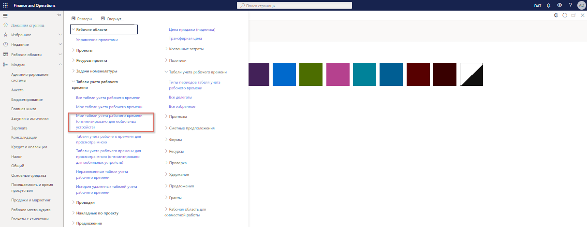

---
demo:
    title: 'Демонстрация 3. Знакомство с затратами по проекту'
    module: 'Модуль 5. Изучение основ Microsoft Dynamics 365 Project Operations'
---

## Демонстрация 3 — знакомство с затратами по проекту

В этой демонстрации дается обзор создания записей времени и расходов, которые будут выставлены по проекту Contoso Consulting. Рассматриваются записи в форматах, оптимизированных для представления в интернете и на мобильных устройствах, а также показывается, как рабочий процесс используется для управления процедурой утверждения.

1. В приложении **Dynamics 365 for Finance and Operations**, на панели навигации последовательно выберите пункты **Модули > Управление и учет по проектам > Табели учета рабочего времени > Мои табели учета рабочего времени (оптимизированы для мобильных устройств)**.  
    Для начала отметим, что хотя прямо сейчас мобильное устройство не используется, вы оцените удобство форм для мобильных устройств, когда будет выбран параметр **Мои табели учета рабочего времени (оптимизированы для мобильных устройств)**.

      

    Данная оптимизация — главная отличительная особенность бизнес-приложений корпорации Майкрософт, и она помогает с минимальным обучением переходить с веб-приложения на приложение для мобильных устройств.

1. Проверьте, чтобы в правом верхнем окне выбора компании, к которой подключаетесь, было указано юридическое лицо **USSI**. Если это не так, измените юридическое лицо на **USSI**.

1. На странице **Мои табели учета рабочего времени** нажмите кнопку **Создать**.  
    Сейчас создадим новый табель, основанный на заданных параметрах.

1. На панели **Новый табель учета рабочего времени** наведите указатель мыши на поле **Дата**.  
    Вводимая дата определяет период табеля учета рабочего времени.

1. Наведите указатель мыши на пункт **Создать на основе избранного**.  
    Если избранные параметры сохранены, тогда для экономии времени можно выбрать вариант создания на основе избранного.

1. По завершении нажмите кнопку **OK**.

1. На странице **Сведения о моих табелях учета рабочего времени** щелкните значок **Новые +**.

1. На панели **Новая строка табеля учета рабочего времени** наведите указатель мыши на поле **Юридическое лицо**.  
    Откроется новая строка табеля учета рабочего времени со сведениями, такими как клиент, проект, категория, свойства строки и параметры налога. Можно также выбрать другое юридическое лицо, если запись времени занесена в интересах другой компании в вашей организации.

1. Откройте меню **Код проекта**.

1. Выберите один из доступных проектов, например, проект **Contoso Consulting**.

1. По завершении нажмите кнопку **OK**.  
    Откроется оптимизированный под мобильные устройства экран ввода времени, и можно начать регистрировать свое рабочее время каждый день для проекта и категории, в данном случае **Служба**.

1. На странице **Ввод времени** в поле **Пн** введите **8**.  
    Это значение представляет запись рабочих часов одного дня.

    

1. В поле **Внутренний комментарий** добавьте комментарий. Пример. **Возможно, стоит переговорить с ними о новых велосипедах**.  
    Можно также вводить внутренние и внешние комментарии по проекту, чтобы гарантировать понимание всеми сторонами природы регистрируемого рабочего времени.

1. В поле **Внешний комментарий** добавьте комментарий. Пример. **Отрегулированы цепи и отцентрированы передние колеса в автопарке**.

1. На панели навигации нажмите кнопку **Сохранить**.

1. В левом меню навигации в разделе **Табели учета рабочего времени** выберите пункт **Мои табели учета рабочего времени**.

1. На странице **Мои табели учета рабочего времени** выберите запись времени, созданную ранее.

1. На вкладке **Табель учета рабочего времени** наведите указатель мыши на столбец «Категория».  
    Теперь предположим, что мы вернулись к компьютеру и просматриваем свое рабочее время на веб-форме табеля учета рабочего времени. По-прежнему можно просматривать ту же самую информацию, такую как категория и часы работы.

1. В разделе **Сведения о строке** наведите указатель мыши на пункты **Внутренний комментарий** и **Внешний комментарий**.  
    Можно также просмотреть комментарии, введенные ранее. Все сведения на месте, но разметка немного отличается. Этот формат часто используется для итогового обзора, так как он проще для просмотра и проверки своего рабочего времени, особенно когда кто-нибудь назначен в несколько проектов или категорий.

1. На панели навигации откройте вкладку **Рабочий процесс**.  
    Если нет замечаний по табелю учета рабочего времени, его можно отправить. Необходимые утверждения определяются в каждой организации на этапе реализации и основываются на собственных политиках компании.

1. На панели **Обзор рабочего процесса табеля учета рабочего времени** нажмите кнопку **Отправить**.

1. На панели **Обзор рабочего процесса табеля учета рабочего времени — Отправка** добавьте любые дополнительные комментарии.

1. Нажмите кнопку **Отправить**.

1. Перейдите на страницу **Почасовые проводки**. Если вкладка **Почасовые проводки** окрашена в серый цвет, перейдите на страницу **Мои табели учета рабочего времени** и выберите ранее созданный табель учета рабочего времени.

1. Находясь на странице **Почасовые проводки**, просмотрите страницу.  
    После утверждения результаты будут разнесены и отображаются на странице почасовых проводок. Доступны для просмотра все уместные сведения, такие как юридическое лицо, проект, категория, рабочие часы, а в данном случае отображаются даже себестоимость и цена продажи.  

Затем можно подробно рассмотреть проводки ваучера.

1. На панели навигации нажмите кнопку **Ваучер**.

1. На странице **Проводки ваучера** наведите указатель мыши на разделы **Счет ГК** и **Название счета**.  
    В этих разделах можно увидеть влияние на главную книгу, а также счета, которые будут использоваться.  

Сейчас давайте создадим запись расходов для того же самого проекта Contoso consulting.

1. На панели навигации последовательно выберите пункты **Модули > Управление расходами > Мои расходы > Отчеты по расходам**.

1. На странице **Управление расходами**, на вкладке **Отчеты** выберите **+ Новый отчет по расходам**.

1. На странице **Новый отчет по расходам**, в поле **Назначение** введите название. Например, **Contoso – фев2021**.

1. Нажмите кнопку **ОК**.

1. На странице **Расходы** выберите **+ Новый расход**.  
Появится новая строка расходов.

1. В столбце **Категория расходов** выберите пункт **Топливо** в раскрывающемся меню **Категория**.  
Здесь можно ввести новые расходы со сведениями о них.

1. В столбце **Сумма проводки** введите значение **25,00**.

1. В столбце **Валюта** выберите **USD**.

1. В столбце **Дата проводки** выберите дату. Например, **1/2/2021**.  
    После того, как введены все сведения, можно сохранить расходы.

1. Нажмите кнопку **Сохранить**.

1. В левом меню навигации в разделе **Рабочие области** выберите пункт **Управление расходами**.

1. На странице **Управление расходами** выберите только что созданный вами отчет по расходам.

1. На странице **Отчет по расходам** выберите поле **Код проекта**, а затем выберите пункт **00000093 Contoso Consulting**.  

Далее можно показать, что плата за топливо выставляется для оплаты по проекту Contoso Consulting, а также увидим дополнительные сведения о расходах.

1. Наведите указатель мыши на поле **Дополнительные сведения**.

1. В правой нижней части экрана нажмите кнопку **Сохранить и продолжить**.

1. В правой части экрана нажмите кнопку **Отправить**.

1. В поле **Комментарий** добавьте любые дополнительные комментарии.

1. Нажмите кнопку **Отправить**.

1. На странице **Управление расходами** наведите указатель мыши на столбец **Статус утверждения**.  
    На данном этапе будут активированы политики командировок и процесс утверждения расходов. Затраты разнесены и применены к проекту Contoso Consulting, а позже будут доступны для выставления счетов, если подлежат оплате.

В этой демонстрации обработаны записи времени и расходов, которые были выставлены для оплаты по проекту Contoso Consulting. Показаны примеры в форматах для Интернета и мобильных устройств, а также продемонстрировано применение рабочих процессов для управления утверждениями, действующими в организации USSI.
