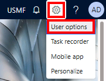

---
lab:
    title: 'Лабораторная работа 1. Управление финансовыми и операционными приложениями'
    module: 'Модуль 1. Изучение основ Microsoft Dynamics 365 Supply Chain Management'
---

# Модуль 1. Изучение основ Microsoft Dynamics 365 Supply Chain Management

## Лабораторная работа 1 — управление финансовыми и операционными приложениями

## Цели

Теперь, когда вы ознакомились с финансовыми и операционными приложениями, уделите некоторое время изучению интерфейса.

## Исходные условия выполнения лабораторной работы

- **Ориентировочное время выполнения работы**: 10 мин

## Инструкции

### Войдите в систему лабораторного компьютера

1. Войдите в систему лабораторного компьютера со следующими учетными данными

    - Имя пользователя:

        Вставьте содержимое

        Administrator

    - Пароль:

        Вставьте содержимое

        pass@word1

    >[!Примечание] На компьютере может автоматически открыться Internet Explorer. Если вы не выполнили шаги 2–5, завершите их выполнение, прежде чем вернуться в Internet Explorer.

1. Выберите на рабочем столе файл **AdminUserProvisioning**.

1. Введите предоставленные учетные данные и нажмите кнопку **Отправить**.  
Ваши учетные данные находятся в меню **Ресурсы** в правом верхнем углу экрана.

1. Дождитесь завершения сценария, прежде чем продолжать работу. Этот процесс занимает около 2-3 минут. После завершения сценария откроется всплывающее окно с подтверждением  успешного обновления пользователя с правами администратора.

1. Чтобы продолжить, нажмите кнопку **Ok**.

1. Откройте **Internet Explorer**.

1. Перейдите по указанной ссылке: <https://usnconeboxax1aos.cloud.onebox.dynamics.com>

1. Выполните вход с учетными данными, предоставляемыми в меню **Ресурсы**.

### Управление финансовыми и операционными приложениями
1. На домашней странице «Финансы и операции», если она настроена, отображаются следующие компоненты:

    - Расположенное слева меню навигации, свернутое по умолчанию.

    - Логотип вашей компании.

    - Плитки рабочей области, доступные в зависимости от вашей роли в организации.

    - Календарь и рабочие элементы, назначенные вам.

    - Очень полезная панель поиска, позволяющая быстро находить необходимые ресурсы.

    - В правом верхнем углу находятся логотип компании, с которой вы работаете в текущий момент, уведомления, настройки и полезные ссылки.  
    Убедитесь, что предоставлена компания **USMF**.

    

1. В левом верхнем углу нажмите кнопку вызова меню **Развернуть панель навигации**.

1. Панель навигации — это место, где будут находиться ваши элементы **Избранное**, **Последние**, **Рабочие области** и **Модули**.

1. На панели навигации последовательно выберите пункты **Модули** > **Администрирование системы**.

1. Просмотрите области, доступные в модуле «Администрирование системы».

1. В меню **Настройка** выберите пункт **Параметры производительности клиента**.

1. На панели «Параметры производительности клиента» в разделе **Выноски включены** установите переключатель в положение **Да**.

1. Ознакомьтесь с другими доступными параметрами, прокрутите экран вниз панели, а затем нажмите кнопку **OK**.

1. На домашней странице в правой верхней части экрана щелкните значок «Настройки» и откройте список «Параметры пользователя».

    

1. Вкладки, присутствующие на странице «Параметры», позволяют установить различные настройки, которые применяются к вашей учетной записи.

1. Перейдите на вкладку **Параметры**.

1. Просмотрите доступные параметры. Обратите внимание, что можно изменить компанию, заданную по умолчанию, а также вид начальной страницы, отображаемой при входе в систему.

1. Откройте и просмотрите вкладки **Учетная запись** и **Рабочий процесс**.

1. В левом меню навигации щелкните значок **Главная**.

1. По центру вверху домашней страницы нажмите кнопку **Поиск страницы**.

1. В поле поиска выполните поиск по ключевой фразе **Все поставщики**.

1. При первом поиске страницы, возможно, потребуется подождать. В процессе поиска справа от поля поиска отображается небольшой вращающийся кружок.

1. Страница «Все поставщики» служит примером страницы списка. Страница списка обычно содержит основные данные, которые можно читать, создавать, удалять и обновлять. Пользуясь лентой, расположенной над списком, можно увидеть дополнительные функции.

    

1. Выделите одного поставщика в списке, откройте справа меню **Связанные сведения** и ознакомьтесь с предоставляемой дополнительной информацией.

1. В списке поставщиков выберите пункт **Acme Office Supplies**.

1. Откройте меню **Группа** и выберите заголовок столбца **Группа поставщиков**.

    

1. Для многих меню доступны сортировка и фильтрация. Фильтры позволяют быстро найти искомое содержимое поля.

1. Обратите внимание на дополнительную функциональность в правом верхнем углу. Наведите указатель мыши на каждый элемент и просмотрите текст выноски. Завершив просмотр выносок, щелкните значок **Закрыть**, чтобы закрыть страницу и вернуться на домашнюю страницу.

    

1. В правом верхнем углу щелкните значок вопроса **Справка** и выберите пункт **Справка**.

1. Обратите внимание, что справочные сведения относятся к текущей странице.

1. Попробуйте выбрать плитку рабочей области и ознакомьтесь со справочными сведениями для этой рабочей области. Завершив просмотр сведений, вернитесь на домашнюю страницу.
