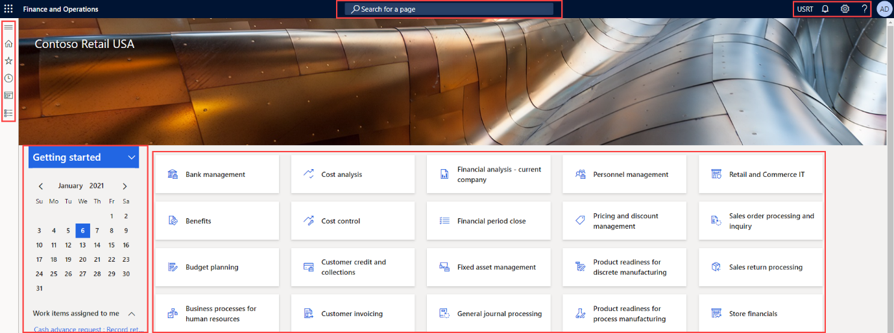

---
lab:
  title: Лаборатория 1. Навигация по финансовым и операционным приложениям
  module: 'Module 1: Explore the core capabilities of Dynamics 365 finance and operations apps'
---

# Модуль 1. Изучение основных возможностей приложений dynamics 365 finance and operations

## Лаборатория 1. Навигация по финансовым и операционным приложениям

## Цель

Теперь, когда вы знакомы с приложениями финансов и операций, займете некоторое время для изучения интерфейса.

## Исходные условия выполнения лабораторной работы

- **Предполагаемое время**: 10 минут

## Instructions

### Вход на компьютер лаборатории

1.  Войдите на компьютер лаборатории с помощью следующих учетных данных:

    - Имя пользователя: `Administrator`

    - Пароль: `pass@word1`

1.  Прежде чем продолжить работу, дождитесь завершения выполнения скрипта AdminUserProvisioning. Это может занять 2–3 минуты. После завершения скрипта на некоторое время откроется всплывающее окно для подтверждения обновления пользователя с правами администратора. 

1.  **Microsoft Edge** откроет URL-адрес Finance and Operations: <https://usnconeboxax1aos.cloud.onebox.dynamics.com>

1.  Выполните вход с помощью имени пользователя и пароля, указанных в меню **Ресурсы**. 

### Навигация по финансовым и операционным приложениям

Теперь, когда вы знакомы с финансовыми и операционными приложениями, займете некоторое время, чтобы изучить интерфейсы.

1.  На домашней **** странице "Финансы и операции", если она настроена, вы найдете:

    - Меню навигации слева, которое свернуто по умолчанию.

    - Логотип вашей компании.

    - Плитки рабочей области, доступные на основе вашей роли в организации.

    - Календарь и рабочие элементы, назначенные вам.

    - Поисковую строку, с помощью которой можно быстро найти необходимые ресурсы.

    - В правом верхнем углу у вас есть компания, с которыми вы работаете в настоящее время, с уведомлениями, параметрами и ссылками справки. Убедитесь, что указана **компания USMF**.

    

2.  В левом верхнем углу нажмите кнопку вызова меню **Развернуть панель навигации**.

3.  В области навигации находятся коллекции для избранных, последних** элементов, **** рабочих** областей и **модулей**.****

4.  В области навигации**** > выберите **"Администрирование** системы модулей".

5.  Просмотрите области, доступные в модуле администрирования системы.

6.  В разделе **"Настройка"** выберите **параметры** производительности клиента.

7.  **В области параметров** производительности клиента в разделе **"Выноски** компонентов" выберите переключатель переключателя и убедитесь, что задано значение **"Да**".

8.  Просмотрите другие доступные параметры, прокрутите внизу области и нажмите кнопку **"ОК**".

9.  В правом верхнем углу **домашней страницы** щелкните значок **Параметры** и выберите **Параметры пользователя**.

    

10. **На странице "Параметры"** используйте вкладки для настройки различных параметров, которые применяются к вашей учетной записи.

11. Выберите вкладку **Параметры**.

12. Просмотрите доступные настройки. Обратите внимание, что при входе в систему можно изменить компанию по умолчанию и начальное представление страницы.

13. Выберите и просмотрите вкладки **"Учетная запись** и **рабочий процесс** ".

14. В меню навигации слева выберите **значок "Главная** ".

15. В середине верхней части **домашней страницы** щелкните поле **Найти страницу**.

16. В поле поиска найдите **всех поставщиков**.

17. Выбор **всех поставщиков** счетов с оплатой > поставщиков

18. Возможно, вам потребуется подождать первый раз, когда вы ищете страницу. В правой части поля поиска имеется небольшой круг спиннинга во время обработки поиска.

19. Страница **"Все поставщики"** является примером страницы списка. Страница списка содержит основные данные, которые можно читать, создавать, удалять и обновлять. Существует больше возможностей, использующих ленту над списком.

    

20. Выделите одного из поставщиков из списка и в правой части выберите **меню "Связанные сведения** " и просмотрите дополнительные сведения, предоставляемые.

21. В списке поставщиков выберите **Acme Office Supplies**.

22. **Выберите меню "Группа**" и выберите **заголовок столбца группы** поставщиков.

    

23. Многие меню имеют доступ к сортировке и фильтрации. Используйте фильтры, чтобы быстро найти нужное содержимое поля.

24. В правом верхнем углу обратите внимание на дополнительные функции. Переместите указатель мыши на каждый элемент и просмотрите выноску функции. После просмотра выносок щелкните значок **Закрыть**, чтобы закрыть страницу и вернуться на **домашнюю страницу**.

    

25. В правом верхнем углу щелкните **значок вопросительного знака справки** и нажмите кнопку **"Справка**".

26. Обратите внимание, что сведения о справке связаны с текущей страницей.

27. Попробуйте выбрать плитку рабочей области, а затем просмотрите сведения о справке для этой рабочей области. После просмотра сведений вернитесь на **домашнюю страницу**.

