---
lab:
    title: 'Лабораторная работа 2. Знакомство с рабочими областями и фильтрацией'
    module: 'Модуль 1. Изучение основ Microsoft Dynamics 365 Supply Chain Management'
---

# Модуль 1. Изучение основ Microsoft Dynamics 365 Supply Chain Management

## Лабораторная работа 2 — знакомство с рабочими областями и фильтрацией

## Цели

При первом входе в приложения Finance and Operations доступно несколько встроенных рабочих областей. Можно также создать собственную рабочую область с содержимым, настроенным под ваши нужды. Рабочие области — одна из множества функций Dynamics 365, но следует также знать, что фильтрация — это реальный способ получить конкретные элементы, которые вы, возможно, ищите. Чтобы найти нужные элементы, следует создать новую персонализированную рабочую область и воспользоваться фильтрацией.

## Исходные условия выполнения лабораторной работы

   - **Ориентировочное время выполнения работы**: 10 мин

## Инструкции

1. На домашней странице Finance and Operations, справа от плиток рабочей области щелкните правой кнопкой мыши или нажмите и удерживайте палец на пустой области, чтобы вызвать меню.

    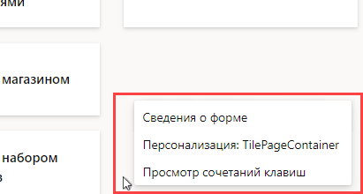

1. В меню выберите команду **Персонализировать: TilePageContainer**.

1. В окне персонализации нажмите кнопку **+ Добавить рабочую область**.

1. Если небольшое окно персонализации не видно, попробуйте прокрутить вверх на домашней странице и щелкнуть правой кнопкой мыши либо нажать и удержать палец, а затем снова выбрать команду **Персонализировать: TilePageContainer**.

    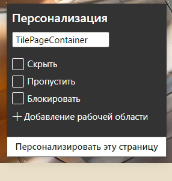

1. На домашней странице прокрутите вниз экрана и найдите новую плитку **Моя рабочая область 1**.

    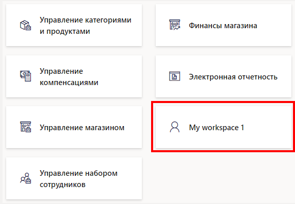

1. Щелкните правой кнопкой мыши либо нажмите и удерживайте плитку, затем выберите в контекстном меню команду **Персонализировать: Моя рабочая область 1**.

1. В окне персонализации измените имя «Моя рабочая область 1» на **Моя рабочая область**, а затем нажмите кнопку **Персонализировать эту страницу**.  
    Измененное имя сохранится автоматически.

1. На вновь открытой панели инструментов нажмите кнопку **Переместить**.

    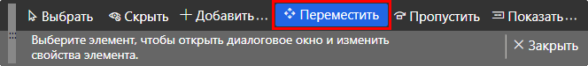

1. Выберите свою плитку **Моя рабочая область** и переместите ее в другое место на домашней странице.

    >[!Примечание] Если не удается переместить плитку, обновите страницу и повторите предыдущие действия, чтобы переместить плитку.

1. Закройте панель инструментов.

1. На домашней странице в поле **Поиск страницы** выполните поиск и выберите **Все поставщики**.

1. На странице «Все поставщики» в меню вверху последовательно выберите пункты **Параметры** > **Добавить в рабочую область**.

1. В поле фильтра **Рабочая область** введите **Моя рабочая область** и выберите рабочую область.

1. Откройте меню «Презентация», просмотрите доступные варианты и выберите пункт **Плитка**.

1. По завершении нажмите кнопку **Настроить**.

1. На панели «Добавить как плитку» проверьте имя плитки и нажмите кнопку **OK**.

1. На левой панели навигации щелкните значок **Главная**.

1. На домашней странице выберите свою новую рабочую область.

1. Убедитесь, что на странице «Моя рабочая область» отображается вновь добавленная плитка «Поставщики».

1. Выберите плитку **Поставщики**.

1. На странице «Все поставщики» в поле **Фильтр** введите **Contoso**.

1. Просмотрите различные поля, которые могут использоваться для поиска Contoso.

    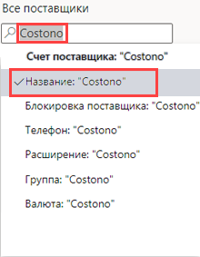

1. Выберите значение **Имя: "Contoso"** и проверьте результаты фильтра.

1. Очистите поле фильтра, а затем нажмите клавишу Enter, чтобы показать всех поставщиков.

1. Щелкните заголовок столбца **Группа**.

    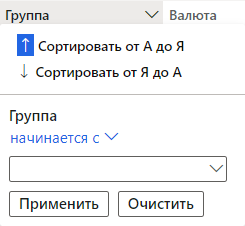

1. Это меню позволяет сортировать группы в порядке возрастания (сортировка от А до Я) или в порядке убывания (от Я до А).

1. В разделе **Группа** откройте меню **начинается с** и ознакомьтесь с операторами сравнения. Выберите оператор **совпадает с**.

1. Откройте меню под оператором **совпадает с** и выберите пункт **Другие поставщики**.  
    Или можно было бы ввести значение в поле меню.

1. Нажмите кнопку **Применить**, а затем просмотрите результаты. Обратите внимание на значок фильтра в заголовке столбца «Группа».

    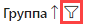

1. Щелкните столбец **Группа** и в меню фильтра выберите команду **Очистить**.

1. Слева от заголовка «Все поставщики» щелкните значок фильтра.

    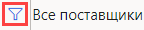

1. В правой верхней части панели фильтра нажмите кнопку **+ Добавить**.

1. На панели добавления полей фильтра установите флажок слева от заголовка **Группа**, а затем нажмите кнопку «Обновить».

1. Заметьте, что добавлен дополнительный фильтр. Это позволит фильтровать список на основе нескольких критериев.

    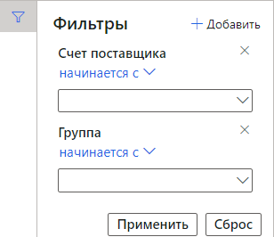

1. Откройте меню фильтра **Счет поставщика начинается с** и выберите пункт **Northwind Traders**.

1. Откройте меню фильтра **Группа начинается с** и выберите значение **30**.

1. Нажмите кнопку **Применить** и просмотрите результаты фильтра.

1. На панели фильтров нажмите кнопку **Сброс** и заметьте, что дополнительный фильтр удален, а в поле фильтра по умолчанию удалено значение.

1. На панели ленты нажмите кнопку **Параметры** и в разделах параметров страницы выберите **Расширенный фильтр / сортировка**.

    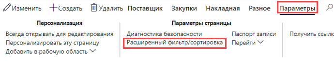

1. В окне «Запрос — поставщики» нажмите кнопку **+ Добавить**.

1. В новой строке в ячейке «Поле» откройте меню и выберите пункт **Группа**.

1. Либо можно открыть меню, начать набирать название группы, а затем выбрать его из результатов фильтра.

1. В ячейке «Критерии» щелкните значок **Открыть**.

    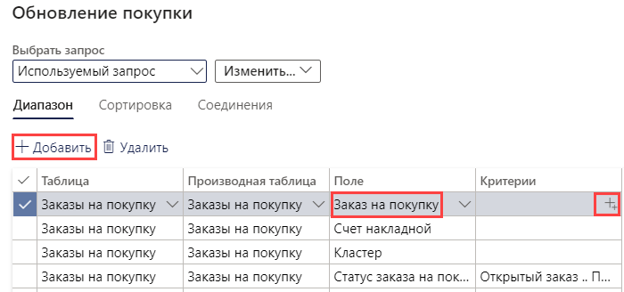

1. В списке группы поставщиков выберите пункт **30 других поставщиков**.

1. Чтобы сохранить новый запрос, в разделе **Выбрать запрос** откройте меню **Изменить** и выберите команду **Сохранить как**.

    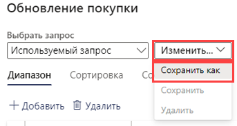

1. На панели сохранения запроса введите в поле **Имя** текст «Мой запрос» и нажмите кнопку **OK**.

1. На странице «Запрос — поставщики» нажмите кнопку **OK**.

1. Убедитесь, что список соответствует результатам вновь созданного запроса.

1. Чтобы удалить фильтр, выберите **Расширенный фильтр / сортировка**, на странице «Запрос — поставщики» нажмите кнопку **Сброс**, а затем нажмите кнопку **OK**.

1. В результате этих действий запрос сбрасывается, но сохраненный запрос не удаляется.
