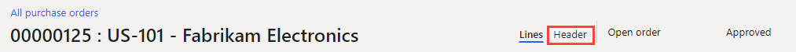

---
lab:
    title: 'Лабораторная работа 4. Создание заказа на покупку'
    module: 'Модуль 1. Изучение основ Microsoft Dynamics 365 Supply Chain Management'
---

# Модуль 1. Изучение основ Microsoft Dynamics 365 Supply Chain Management

## Лабораторная работа 4 — создание заказа на покупку

## Цели

Чаще всего заказы на покупку создаются автоматически в результате сводного планирования, прямой поставки и при выполнении других процессов. При создании вручную заказ на покупку обычно создается агентом по закупкам. Создайте заказ на покупку, используя компанию USMF.

## Исходные условия выполнения лабораторной работы

   - **Ориентировочное время выполнения работы**: 10 мин

## Инструкции

1. На домашней странице Finance and Operations проверьте в правом верхнем углу, что вы работаете с компанией USMF.

1. При необходимости выберите компанию, открыв меню и выбрав пункт **USMF**.

1. В левом верхнем углу нажмите кнопку вызова меню **Развернуть панель навигации**.

1. Выберите последовательно пункты **Модули** > **Закупки и поиск источников** > **Заказы на покупку** > **Все заказы на покупку**.

1. На странице «Все заказы на покупку» в верхнем меню выберите пункт **+ Новые**.

1. На панели Создание заказа на покупку откройте меню **Счет поставщика** и выберите пункт **US-101**.

1. При выборе поставщика сведения из записи поставщика, такие как адрес, счет накладной, условия доставки и способ доставки, копируются в заголовок заказа в качестве значений по умолчанию. В любой момент эти значения можно изменить.

1. Разверните раздел **Общие**.

1. В разделе **АНАЛИТИКИ ХРАНЕНИЯ** откройте меню **Сайт** и просмотрите список сайтов.

1. Поле «Сайт» вместе с полем «Склад» определяют пункт, куда должны поставляться закупаемые товары и услуги. Адресом доставки по умолчанию является сайт. Оба поля могут заполняться значениями, заданными для выбранного поставщика, или можно ввести значения вручную.

1. В разделе **ДАТЫ** в поле «Дата поставки» указывается, когда должны быть поставлены закупленные товары и услуги.

1. Можно задать одну дату поставки для заказа либо можно задать индивидуальные даты поставки для отдельных строк заказа. Если заданная здесь дата поставки не может быть соблюдена для специфических продуктов или услуг по причине более длительных сроков выполнения заказа, тогда эти строки создаются с более поздней датой поставки, чтобы подстроиться под конкретную ситуацию.

1. Разверните раздел **Администрирование**. В поле **Заказчик** указывается, кто разместил заказ.

1. Возможно, этими сведениями удобно поделиться с поставщиком на случай, если ему потребуется связаться с этим человеком. Значение может присваиваться автоматически, если текущая учетная запись пользователя связана с именем на странице пользователей.

1. Нажмите кнопку **ОК**.

1. Заголовок заказа готов.. При работе со строками заказа на покупку отображается только сводная информация заголовка. Если необходимо просмотреть остальные сведения, нажмите кнопку **Заголовок**.

    

1. В меню раздела **Строки заказа на покупку** выберите пункт **Строка заказа на покупку**.

    

1. В разделе **ПОКАЗАТЬ** выберите пункт **Аналитики**.

1. Возможны разные варианты продуктов, отличающихся по характеристикам, таким как цвет, размер и стиль. Продукты могут быть также настроены на использование аналитик хранения, таких как сайт и склад. Существуют также дополнительные аналитики отслеживания, такие как номера партий и серийные номера. Для повышения производительности ввода заказа можно добавить часто используемые поля аналитик непосредственно в сетку заказа.

1. На панели Отображение аналитик в разделе **АНАЛИТИКИ ПРОДУКТА** установите флажок **Цвет**.

1. Дополнительно: Если установлен переключатель «Сохранить настройки», при последующем открытии заказа на покупку отобранные аналитики также будут отображаться на сетке строк заказа.

1. Нажмите кнопку **ОК**.

1. Откройте меню ячейки **Номенклатурный номер** и выберите значение **T0004**.

1. Помните, вместо прокрутки списка можно также ввести значение в поле фильтра.

1. Строки заказа для продуктов и услуг создаются путем указания номенклатурного номера либо как расходы посредством определения категории закупаемой продукции.

1. Категория закупаемой продукции применяется для добавления строк, где закупаемая номенклатура напрямую списывается в расходы вместо поступления в запасы. Если надо списать расходы на покупку, это можно сделать это путем создания строки заказа на покупку, где указывается категория закупаемой продукции, а не создавать строку с номенклатурным номером. Номенклатуры могут быть также связаны с категорией закупаемой продукции, и в этом случае категория закупаемой продукции отображается лишь в справочных целях.

1. Откройте меню **Цвет**, просмотрите доступные варианты, а затем выберите один из цветов или одну из комбинаций цветов.

1. Поля «Сайт» и «Склад» обычно заполняются значениями из заголовка заказа, но можно переопределить поля, если для некоторых строк поставка выполняется в другие места.

1. Введите в поле **Количество** значение **10**.

1. Поле «Количество» автоматически заполняется минимальным количеством по заказу продукта, если эта настройка задана, или значением 1.

1. Дополнительные сведения:

    - **Ед. изм.**: Показывает единицы измерения заказанного количества. Обычно единицы измерения автоматически предоставляются из единиц измерения покупки, входящих в сводные данные продукта.

    - **Цена за единицу**: Содержит значение или из договора покупки, или из коммерческого соглашения. Цену за единицу в отдельных строках заказа можно изменять, например, если с поставщиком согласована индивидуальная цена.

    - **Скидка**: Представляет сумму скидки за единицу товара. Цена за единицу уменьшается на величину скидки. Данная скидка обычно предоставляется автоматически из договора покупки или коммерческого соглашения, однако скидки можно переопределить в отдельных строках, если с поставщиком согласованы индивидуальные скидки.

    - **Процент скидки**: Когда вводится процент скидки, чистая сумма в строке уменьшается соответствующим образом. Процент скидки часто предоставляется автоматически из договора покупки или коммерческого соглашения, однако процент скидки можно переопределить в отдельных строках, если с поставщиком согласован индивидуальный процент скидки.

    - **Чистая сумма**: Вычисляется по значениям из других полей в строке, включая количество, цену за единицу, скидку и процент скидки. Чистую сумму можно изменить, но тогда поля «Цена за единицу», «Скидка» и «Процент скидки» будут пустыми, а при разноске строки разнесенная сумма будет пропорциональна чистой сумме. Обычно поле «Чистая сумма» предназначено лишь для отображения чистой суммы строки.

1. Под строками заказа на покупку, внизу страницы нажмите кнопку **Сведения о строке**.

1. Перейдите на вкладку **Поставка**.

1. Для каждой строки заказа может быть назначена индивидуальная дата поставки. Дата наследуется из поля в заголовке заказа на покупку, тем не менее ее можно изменить.

1. Закройте страницу строки заказа на покупку.

1. Воспользуйтесь на странице «Все заказы на покупку» функцией фильтра и найдите свой новый заказ на покупку.

1. Завершив выполнение лабораторной работы, закройте страницу «Все заказы на покупку» и вернитесь на домашнюю страницу.
