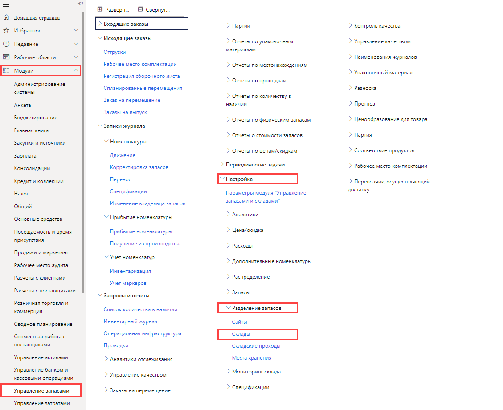
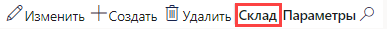

---
lab:
    title: 'Лабораторная работа 5. Создание склада'
    module: 'Модуль 1. Изучение основ Microsoft Dynamics 365 Supply Chain Management'
---

# Модуль 1. Изучение основ Microsoft Dynamics 365 Supply Chain Management

## Лабораторная работа 5 — создание склада

## Цели
Система управления складом в управлении логистическими цепочками обеспечивает гибкость планировки складирования в соответствии с изменяющимися потребностями и позволяет добиться максимальной эффективности склада.

- Для оптимального размещения товаров можно установить области хранения с высоким и низким приоритетом.
- Склад можно разделить на зоны для соблюдения различных условий хранения, например, требований по температуре или различных коэффициентов оборачиваемости номенклатур.
- Местонахождение склада можно задать на любом уровне (например, сайт, склад, проход, стеллаж, полка и положение ячейки).
- Местоположения можно группировать, используя настройки ограничений по физической емкости.
- Хранением и комплектацией номенклатур можно управлять на основе правил, определяемых запросами.

Чтобы использовать управление складом в управлении логистическими цепочками, необходимо создать склад и включить его для расширенных и специализированных операций управления складом.

## Исходные условия выполнения лабораторной работы

   - **Ориентировочное время выполнения работы**: 10 мин

## Инструкции

1. На домашней странице Finance and Operations проверьте в правом верхнем углу, что вы работаете с компанией USMF.

1. При необходимости выберите компанию, открыв меню и выбрав пункт **USMF**.

1. На левой панели навигации последовательно выберите пункты **Модули** > **Управление запасами** > **Настройка** > **Разделение запасов** > **Склады**.

    

1. На странице «Склады» в верхнем меню выберите пункт **Создать**.

1. Введите в поле **Склад** значение **101**.

1. Введите в поле **Имя** значение **Переполненный склад**.

1. Откройте меню **Сайт** и выберите пункт **Производство 3 монтажных пен**.

1. Разверните раздел **Наименование местоположений**.  
    Параметры этого раздела определяют формат по умолчанию для наименований местоположений.

1. Установите для параметров **Включать проход** и **Включать стеллаж** значение **Да**.

1. В поле **Формат** для стеллажа введите значение.  
    Например, если формат наименования местоположения стеллажа должен содержать аббревиатуру «ПРПЛ», следует ввести ее в поле «Формат».

1. В разделе **УРОВЕНЬ** установите для параметра **Включать полку** значение **Да**.

1. В поле **Формат** для полки введите значение **-##**.

1. В меню вверху выберите **Склад**.

    

1. В разделе **Поддержка** выберите пункт **Мастер ячеек хранения**.

1. На странице приветствия просмотрите сведения, а затем в правом нижнем углу нажмите кнопку **Далее**.

1. Сбросьте флажки **Дебаркадеры отгрузки** и **Сборные ячейки**.

1. Нажмите кнопку **Далее** и просмотрите сведения.

1. Продолжайте просматривать каждую страницу, а после завершения нажмите кнопку **Готово**.

1. Закройте страницу и вернитесь на домашнюю страницу.
