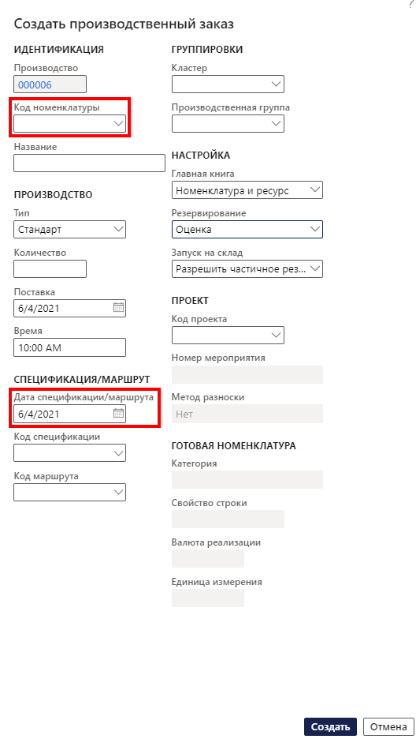

---
lab:
    title: 'Лабораторная работа 6. Создание производственного заказа'
    module: 'Модуль 1. Изучение основ Microsoft Dynamics 365 Supply Chain Management'
---

## Лабораторная работа 6 — создание производственного заказа

## Цели

Производственный заказ содержит сведения о том, что будет производиться, производимом количестве и планируемой дата окончания. Он также содержит сведения о расходуемых материалах и производственном процессе.

Вам необходимо создать новый производственный заказ для своей компании.

## Исходные условия выполнения лабораторной работы

   - **Ориентировочное время выполнения работы**: 5 мин

## Инструкции

1. На домашней странице Finance and Operations проверьте в правом верхнем углу, что вы работаете с компанией USMF.

1. При необходимости выберите компанию, открыв меню и выбрав пункт **USMF**.

1. На левой панели навигации последовательно выберите пункты **Модули** > **Управление производством** > **Производственные заказы** > **Все производственные заказы**.

1. В меню вверху выберите **Новый производственный заказ**.

1. В разделе **ИДЕНТИФИКАЦИЯ** введите в поле **Номенклатурный номер** значение **D0001** и выберите идентифицированную номенклатуру.

1. В разделе **ПРОИЗВОДСТВО** в поле **Поставка** выберите дату через месяц от сегодняшней.  
    Дата поставки показывает, когда производственный заказ должен завершиться, чтобы вовремя выполнить поставку. Эта дата может использоваться в процессе планирования. Например, можно запланировать заказ, ведя отсчет в обратную сторону от даты поставки.

1. Введите в поле **Количество** значение **20**.

1. В разделе **СПЕЦИФИКАЦИЯ/МАРШРУТ** в поле «Номер спецификации» автоматически отображается номер любой активной спецификации для текущей номенклатуры, однако спецификацию для производственного заказа можно изменить, выбрав активную спецификацию из списка утвержденных версий спецификации. В поле «Номер маршрута» автоматически отображается номер любого активного маршрута для текущей номенклатуры, однако маршрут для производственного заказа можно изменить, выбрав активный маршрут из списка утвержденных версий маршрута.

    

1. Нажмите кнопку **Создать**.
