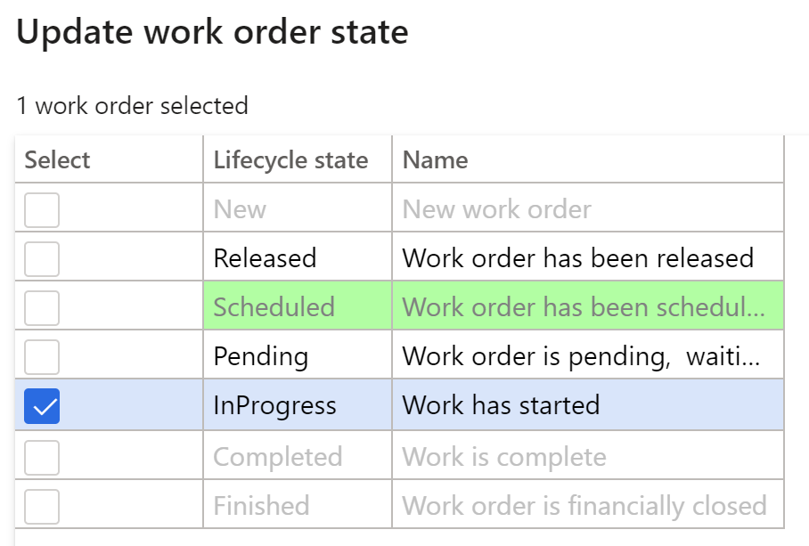

---
lab:
    title: 'Лабораторная работа 7. Создание заказа на обслуживание'
    module: 'Модуль 1. Изучение основ Microsoft Dynamics 365 Supply Chain Management'
---

## Лабораторная работа 7. Создание заказа на обслуживание

**Цели**

Заказы на обслуживание, размещенные в системе, описывают обслуживание или ремонт, необходимые для активов, и используются для назначения соответствующих ресурсов для выполнения запроса на обслуживание. Заказ на работу, создается на основе заказа на обслуживание, который выполняется через распределение ресурсов.

**Исходные условия выполнения лабораторной работы**

Приблизительное время: 15 мин

**Инструкции**

1. На домашней странице Finance and Operations проверьте в правом верхнем углу, что вы работаете с компанией USMF.

2. При необходимости выберите компанию, открыв меню и выбрав пункт **USMF**.

3. На левой панели навигации щелкните **Модули** **&gt; Управление активами &gt; Настройка &gt; Запрос на обслуживание &gt; Состояния жизненного цикла.**

4. Выберите «Выполняется» и нажмите кнопку **Изменить** на панели операций.

5. На вкладке **Общие** измените значение **Создать заказ на работу** на «Да».

6. На левой панели навигации щелкните **Модули** **&gt; Управление активами &gt; Рабочие области &gt; Запрос на обслуживание &gt; Управление заказами на обслуживание.**

7. Щелкните **Создать заказ на обслуживание.**

8. Введите следующие значения в поля диалогового окна и нажмите кнопку **OK**.

	- Тип заказа на обслуживание: корректировка

	- Описание: шум в металлоискателе

	- Функциональном местоположение: PP-02-02

	- Актив: MD-201

	- Уровень обслуживания: 4

	- Симптом неисправности: повышенный шум

	- Область неисправности: электрика 

9. Закройте форму **Запрос на обслуживание** и вернитесь в рабочую область **Управление заказами на обслуживание**.

10. Обновите страницу, нажав значок **обновления** в верхнем правом углу экрана.

11. Появится новый запрос на обслуживание в списке запросов на обслуживание без заказа на работу.

12. Выберите вновь созданный запрос на обслуживание и нажмите кнопку **Обновить состояние запроса на обслуживание**. 

13. В диалоговом окне установите флажок рядом с элементом «Выполняется» и нажмите кнопку **OK**

 

14. Выберите вновь созданный запрос на обслуживание и нажмите кнопку **Создать заказ на работу**. 

15. Введите следующие значения в поля диалогового окна и нажмите кнопку **OK**.

	- Тип задания обслуживания: проверка

16. Будет создан новый заказ на работу и обновится заказ на работу в выбранной записи запроса на обслуживание.

17. Щелкните заказ на работу перейдите на экран **Сведения заказа на работу**.

18. В разделе заказ на работу «Строки» нажмите кнопку **Подготовить к отправке**.

19. Введите следующие значения в поля диалогового окна и нажмите кнопку **OK**.

	- Рабочий: Тед Говард (Ted Howard)

20. В меню действий выберите последовательно **Заказ на работу &gt; Состояние жизненного цикла &gt; Обновить состояние заказа на работу.**

21. В диалоговом окне установите флажок рядом с элементом «Выполняется» и нажмите кнопку **OK**

22. Выберите дату и время **Фактическое начало** в диалоговом окне и нажмите кнопку **OK.**

23. В меню действий заказа на работу снова последовательно выберите **Заказ на работу &gt; Состояние жизненного цикла &gt; Обновить состояние заказа на работу.**

24. В диалоговом окне установите флажок рядом с элементом «Завершен» и нажмите кнопку **OK**

25. Выберите дату и время в поле **Фактическое окончание**, превышающие дату и время начала, и нажмите кнопку «ОК»

26. Для заказа на работу отобразится текущее состояние жизненного цикла «Завершен».
