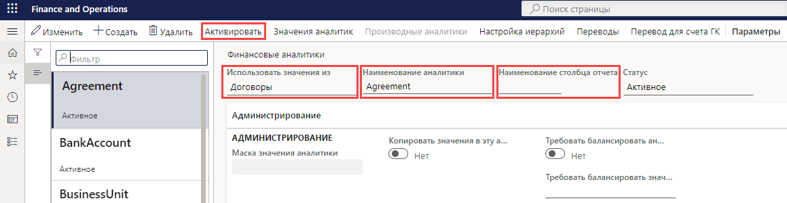
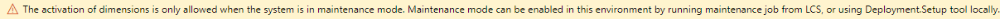

---
lab:
    title: 'Лабораторная работа 1. Создание финансовой аналитики'
    module: 'Модуль 2. Изучение основ Microsoft Dynamics 365 Finance'
---

## Лабораторная работа 1 — создание финансовой аналитики

## Цели

Страница финансовых аналитик предназначена для создания финансовых аналитик, которые могут использоваться как сегменты счета для планов счетов. Существует два типа финансовых аналитик: пользовательские аналитики и объекто-ориентированные аналитики. Пользовательские аналитики совместно используются юридическими лицами, причем значения вводятся и обслуживаются пользователями. Значения объекто-ориентированных аналитик определяются где-нибудь внутри системы, например, в объектах «Пользователи» или «Хранилища». Некоторые объекто-ориентированные аналитики совместно используются юридическими лицами, тогда как другие объекто-ориентированные аналитики применяются лишь в отдельных компаниях.

Вам необходимо создать пользовательскую финансовую аналитику, которая будет применяться в вашей компании.

## Исходные условия выполнения лабораторной работы

   - **Ориентировочное время выполнения работы**: 5 мин

## Инструкции

1. На домашней странице Finance and Operations проверьте в правом верхнем углу, что вы работаете с компанией USMF.

1. При необходимости выберите компанию, и, открыв меню, выберите компанию **USMF**.

1. На левой панели навигации последовательно выберите пункты **Модули** > **Главная книга** > **План счетов** > **Аналитики** > **Финансовые аналитики**.

1. В меню вверху выберите пункт **+ Новые**.

1. На странице финансовых аналитик откройте меню **Использовать значения из** и выберите пункт **< Пользовательская аналитика >**.

1. В поле **Имя аналитики** введите **Выручка_компаньона**.

1. В поле **Имя столбца отчета** введите **Компн**.

1. В меню вверху выберите команду **Активировать**.

    

1. Просмотрите сведения в диалоговом окне и нажмите кнопку **Закрыть**.

1. Ознакомьтесь с баннером предупреждения.

    

    >[!ПРИМЕЧАНИЕ] Режим обслуживания может включаться и выключаться непосредственно через Lifecycle Services (LCS) в песочнице и производственной среде. Дополнительные сведения об управлении Lifecycle Services см. на веб-сайте [https://docs.microsoft.com/ru-ru/dynamics365/fin-ops-core/dev-itpro/deployment/maintenanceoperationsguide-newinfrastructure](https://docs.microsoft.com/ru-ru/dynamics365/fin-ops-core/dev-itpro/deployment/maintenanceoperationsguide-newinfrastructure).
