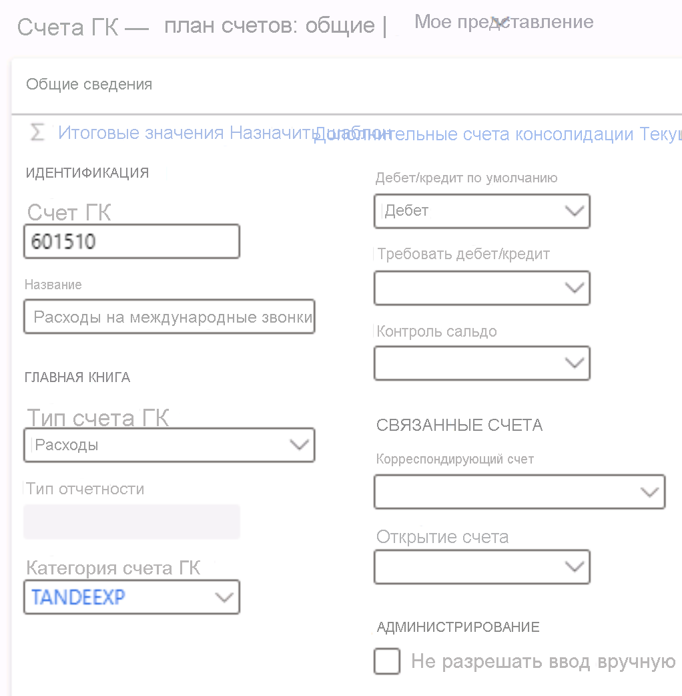

---
lab:
  title: Задание 1. Создание основной учетной записи
  module: 'Module 2: Learn the Fundamentals of Microsoft Dynamics 365 Finance'
ms.openlocfilehash: 6568afcb26212ab952a48dfaf7bb4f377e4ffd36
ms.sourcegitcommit: aa74c0578c7018838f0c935f5901e9c667ef0801
ms.translationtype: HT
ms.contentlocale: ru-RU
ms.lasthandoff: 07/14/2022
ms.locfileid: "147116655"
---
# Модуль 2: Изучение основ Microsoft Dynamics 365 Finance
    
## Задание 1. Создание счета ГК

## Инструкции

1. На домашней странице **Finance and Operations** в правом верхнем углу проверьте, что вы работаете с компанией USMF.

2. При необходимости выберите компанию, и, открыв меню, выберите компанию **USMF**.

3. В области навигации слева выберите **Модули** > **Главная книга** > **План счетов** > **Счета** > **Счета ГК**.

4. В меню вверху выберите пункт **+ Новые**.

5. На странице счета ГК введите следующие значения:

    - Счет ГК: **601510**

    - Имя: **Расходы на международные звонки**

    - Основной тип расхода: **Расход**

    - Категория счета ГК: **TANDEEXP**

    - Дебет/кредит по умолчанию: **Дебет**

 
