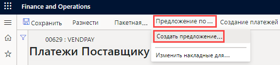
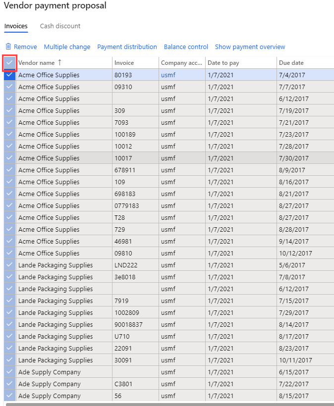

---
lab:
    title: 'Лабораторная работа 2. Создание журнала платежей поставщикам'
    module: 'Модуль 2. Изучение основ Microsoft Dynamics 365 Finance'
---

## Лабораторная работа 2 — создание журнала платежей поставщикам

## Цели

Организации, проводящие платежи поставщикам на регулярной основе, теперь могут автоматизировать процесс создания предложений по платежам поставщикам. В процессе автоматизации предложений по платежам поставщикам определяются следующие сведения:

- время выполнения предложений по платежам поставщикам;
- критерии выбора накладных для оплаты;
- журнал платежей поставщикам, в котором сохраняются итоговые платежи.

При автоматизации предложений по платежам автоматическая разноска платежей не выполняется. Вследствие этого можно продолжать использовать любые процедуры проверки и рабочие процессы, которые применяются в настоящее время для утверждения создаваемых платежей.

Создание новой записи в журнале платежей поставщикам и предложения по платежам.

## Исходные условия выполнения лабораторной работы

   - **Ориентировочное время выполнения работы**: 10 мин

## Инструкции

1. На домашней странице Finance and Operations проверьте в правом верхнем углу, что вы работаете с компанией USMF.

1. При необходимости выберите компанию, и, открыв меню, выберите компанию **USMF**.

1. На левой панели навигации последовательно выберите пункты **Модули** > **Расчеты с поставщиками** > **Платежи** > **Журнал платежей поставщикам**.

1. В меню вверху выберите пункт **+ Новые**.

1. Обратите внимание, что создан новый номер партии в журнале.

1. В поле **Имя** введите **Пост**, а затем выберите **ПлатПост** в отфильтрованном списке.

1. В меню вверху выберите пункт **Строки**.

1. На странице «Платежи поставщикам», в меню вверху последовательно выберите пункты **Предложение по платежам** > **Создать предложение по платежам**.  
    Предложение по платежам — это запрос, используемый для выбора накладных для оплаты. Список накладных для оплаты можно изменять до создания или генерирования платежей поставщикам.

    

1. На панели «Предложение по платежам поставщикам», в разделе **КРИТЕРИИ ВЫБОРА НАКЛАДНОЙ** откройте меню **Выбрать накладные по**, ознакомьтесь с доступными вариантами и выберите пункт **Дата оплаты**.

1. В полях **С даты** и **До даты** удалите существующие значения. В данном упражнении эти диапазоны дат оставляются пустыми.

    >[!ПРИМЕЧАНИЕ] В качестве даты платежа может использоваться минимальная дата платежа. Минимальной датой платежа будет самая ранняя дата, используемая при создании платежей. Например, если дата оплаты накладной следует за минимальной датой платежа, дата оплаты станет датой платежа вместо минимальной даты платежа, чтобы накладная оплачивалась на самую позднюю из возможных дат.

1. Разверните список **Записи для добавления** и просмотрите доступные варианты.  
    Для ограничения накладных, выбираемых для платежа по группе поставщиков или методу платежа, часто используется фильтр. Например, можно добавить фильтр, чтобы в этом цикле оплаты оплачивать накладные только по чеку.

1. Разверните список **Дополнительные параметры** и просмотрите доступные варианты.  
    Дополнительные параметры позволяют определить валюту платежа или включить централизованные платежи для данного цикла оплаты.

1. Нажмите кнопку **ОК**.  
    После нажатия кнопки OK появятся результаты запроса. Если не хотите предварительно просматривать список накладных, выбираемых для оплаты, можно вернуться на экспресс-вкладку «Параметры» и установить для настройки **Создать платежи без предварительного просмотра накладной** значение **Да**.

1. В окне «Предложение по платежам поставщикам» нажмите кнопку **Показать обзор платежей**, чтобы просмотреть платежи, которые буду созданы для поставщика по выбранной накладной.

    

1. Выберите в меню команду **Скрыть обзор платежей**, чтобы скрыть платежи.

1. Установите флажок слева от заголовка столбца **Имя поставщика**, чтобы выбрать все накладные.

    

1. Сбросьте флажки для первых трех накладных, а затем выберите в меню команду **Удалить**, чтобы удалить все остальные накладные.

    

1. В диалоговом окне нажмите кнопку **Да**.

1. Просмотрите оставшиеся три накладные.

1. Чтобы экспортировать список накладных в Excel, щелкните правой кнопкой мыши сетку и выберите в контекстном меню команду экспорта.

1. В правом нижнем углу экрана нажмите кнопку **Создать платежи**, чтобы создать платежи поставщикам в журнале платежей.

1. Просмотрите список платежей поставщикам.
