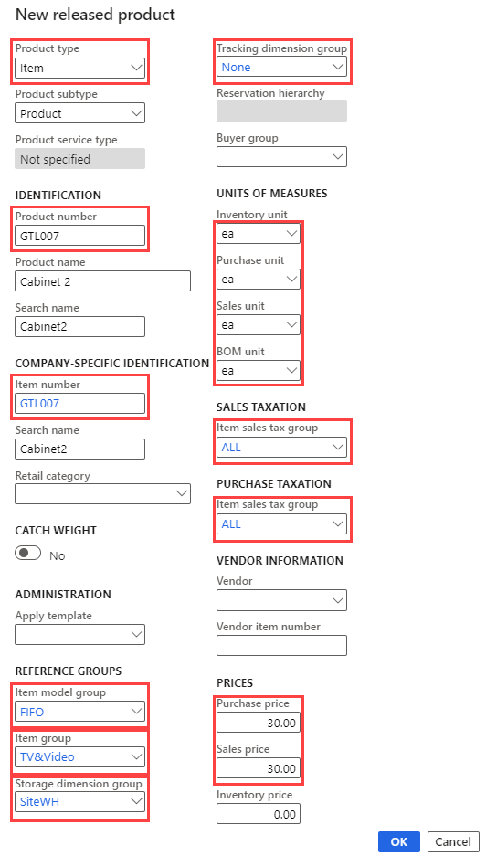

---
lab:
  title: Задание 1. Создание нового продукта
  module: 'Module 3: Learn the Fundamentals of Microsoft Dynamics 365 Supply Chain Management'
---

# Модуль 3. Изучение основ Microsoft Dynamics 365 Supply Chain Management

## Задание 1. Создание нового продукта

## Назначение

В американской компании Contoso Entertainment System (USMF) требуется создать новый элемент для новой конфигурации тумбы, покупаемой у поставщиков. 

## Исходные условия выполнения лабораторной работы

   - **Примерное время**: 10 мин

## Инструкции

1.  На домашней странице **Finance and Operations** в правом верхнем углу убедитесь, что вы работаете с компанией **USMF** . 

1.  При необходимости выберите компанию, и, открыв меню, выберите компанию **USMF**.

1.  В левом верхнем углу нажмите кнопку вызова меню **Развернуть панель навигации**. 

1.  В области навигации в модуле **Управление информацией о продукте** выберите **Продукты** > **Выпущенные продукты**. 

1.  На странице **Сведений о выпущенном продукте** выберите  **+ Создать** в области действий. 

1.  В области **Новый выпущенный продукт** в поле **Тип** продукта убедитесь, что выбран **элемент** . 

1.  Убедитесь, что в поле **Подтип** продукта выбран **продукт** . 

1.  Выберите меню **Группа** измерений Отслеживание и введите или выберите пункт `None` 

1.  В разделе **ИДЕНТИФИКАЦИЯ** в поле **Номер продукта** введите `GTL007`

1.  В поле **Название** продукта введите `Cabinet 2`

1.  В разделе **ГРУППЫ ССЫЛОК** в поле **Группа** модели элементов введите или выберите `FIFO` Первый In-First Out. 

1.  В поле **Группа элементов** введите или выберите `TV&Video` 

1.  В поле **Группа измерений хранилища** введите или выберите `SiteWH` 

1.  Убедитесь, что в разделе **ЕДИНИЦЫ ИЗМЕРЕНИЯ** установлены следующие значения: 

    | **Параметр**    | **Значение** |
    | :------------- | :-------- |
    | Ед. изм. складского учета | шт. каждого   |
    | Единица для покупки  | шт. каждого   |
    | Ед. изм. продажи     | шт. каждого   |
    | Ед. изм. спецификации       | шт. каждого   |

1.  В разделе **НАЛОГ С ПРОДАЖ** в **поле Налоговая группа с продаж товаров** введите или выберите `ALL` 

1.  В разделе **Налог на покупку** **введите или выберите в разделе Налоговая группа с продаж товаров**. `ALL` 

1.  В разделе **ЦЕНЫ** в поле **Цена** покупки введите `30.00`

1.  В поле **Цена** продажи введите `30.00`

1.  Убедитесь, что новый **выпущенный продукт** выглядит следующим образом: 

    

1.  Выберите **OK**. 

1.  Чтобы убедиться, что продукт завершен, в области действий в разделе **Обслуживание** выберите действие **Проверить** . 

    

1.  Убедитесь, что вы получили уведомление, подтверждающее, что все необходимые значения полей были проверены. 

    

1.  Выберите **Сохранить** , **закройте** все страницы и вернитесь на домашнюю страницу. 

