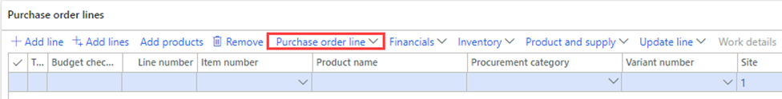

---
lab:
  title: Лабораторная работа 2. Создание заказа на покупку
  module: 'Module 3: Learn the Fundamentals of Microsoft Dynamics 365 Supply Chain Management'
---

# Модуль 3. Изучение основ Microsoft Dynamics 365 Supply Chain Management

## Лабораторная работа 2. Создание заказа на покупку

## Исходные условия выполнения лабораторной работы

   - **Примерное время**: 15 мин.

## Назначение

В этом задании вы ознакомитесь с пользовательским интерфейсом и различными полями, доступными в форме заказа на покупку. Вы также узнаете, как создать новый заказ на покупку.

## Исходные условия выполнения лабораторной работы

   - **Примерное время**: 10 мин

## Инструкции

1. На домашней странице Финансы и операции в правом верхнем углу убедитесь, что вы работаете с компанией **USMF** . При необходимости выберите компанию и в раскрывающемся списке выберите **USMF**.

2. В левом верхнем углу выберите меню **Гамбургер в области навигации** .

3. Выберите последовательно пункты **Модули** > **Закупки и поиск источников** > **Заказы на покупку** > **Все заказы на покупку**.

4. На странице **Все заказы на покупку** в верхнем меню выберите **+Создать**.

5. В области **Создание заказа на покупку** выберите раскрывающийся список **Учетная запись поставщика** , а затем — **US-101**.

> [!NOTE]
> Примечание. При выборе поставщика данные из записи поставщика, такие как адрес, счет счета, условия доставки и режим доставки, копируются в качестве значений по умолчанию в заголовок заказа. В любой момент эти значения можно изменить.

6.  При необходимости разверните раздел **Общие**.

7. В разделе **ИЗМЕРЕНИЯ ХРАНИЛИЩА** выберите раскрывающийся список **Сайт** и просмотрите список сайтов.

Поле **"Сайт** " вместе с полем **"Склад** " указывает, куда необходимо доставить закупаемые товары или услуги. Адресом доставки по умолчанию является адрес местонахождения. Оба поля могут заполняться значениями, заданными для выбранного поставщика, или можно ввести значения вручную.

8. В разделе **ДАТА** используется поле **Дата доставки** , чтобы указать, когда необходимо доставить закупаемые товары и услуги.

    Можно задать одну дату поставки для заказа, либо можно задать индивидуальные даты поставки для отдельных строк заказа. Если указанная здесь дата доставки не может быть достигнута для конкретных продуктов или служб, так как они имеют более длительное время выполнения, эти строки создаются с более поздней датой доставки.

9. Разверните раздел **Администрирование**. В поле **Заказчик** указывается, кто разместил заказ.

    Возможно, этими сведениями удобно поделиться с поставщиком на случай, если ему потребуется связаться с этим человеком. Значение может быть присвоено автоматически, если учетная запись текущего пользователя связана с именем на странице **Пользователи** .

10. Щелкните **ОК**.

Заголовок заказа готов. При работе со строками заказов на покупку отображается только сводка сведений о заголовке. Если необходимо просмотреть остальные сведения, нажмите кнопку **Заголовок**.

11. В разделе **Строки заказа на покупку** в меню выберите **Пункт Строка заказа на покупку**.

12. В разделе **ПОКАЗАТЬ** выберите пункт **Аналитики**.

    Продукты могут быть в вариантах, различаемых по размеру, например цвету, размеру или стилю. Продукты могут быть также настроены на использование аналитик хранения, таких как сайт и склад. Существуют также дополнительные аналитики отслеживания, такие как номера партий и серийные номера. Для повышения производительности ввода заказа можно добавить часто используемые поля аналитик непосредственно в сетку заказа.

13.  На панели **Отображение аналитики** в разделе **Аналитики продуктов** установите флажок **Цвет**.

Необязательно. Если вы выберете переключатель **Сохранить настройки** , выбранные размеры также будут отображаться в сетке строки заказа при следующем открытии страницы заказа.

14. Щелкните **ОК**.

15. Выберите раскрывающийся список **Номер элемента** , а затем выберите **T0004**.

Помните, вместо прокрутки списка можно также ввести значение в поле фильтра.

Строки заказа для продуктов и услуг создаются путем указания номенклатурного номера либо как расходы посредством определения категории закупаемой продукции.

Категория закупаемой продукции применяется для добавления строк, где закупаемая номенклатура напрямую списывается в расходы вместо поступления в запасы. Если вам нужно сделать покупку, это можно сделать, создав строку заказа на покупку, которая указывает категорию закупки, а не строку с номером товара. Элементы также могут быть связаны с категорией закупок, и в этом случае категория закупок отображается только как информационная.

16. Выберите раскрывающийся список **Цвет** , просмотрите доступные параметры, а затем выберите один из цветов или сочетаний цветов.

17. **Сайт** и **склад** обычно заполняются значениями из заголовка заказа, но поля можно переопределить, если некоторые строки необходимо доставить в разные места.

18. Введите в поле **Количество** значение **10**.

    **В поле Количество** автоматически указывается минимальное количество заказа для продукта, если оно настроено, или **значением 1**.

19. Дополнительные сведения:

- **Ед. изм.** : Показывает единицы измерения заказанного количества. Обычно единицы измерения автоматически предоставляются из единиц измерения покупки, входящих в сводные данные продукта.

- **Цена за единицу**: Содержит значение или из договора покупки, или из коммерческого соглашения. Можно изменить цену за единицу в отдельных строках заказов, например, если уникальная цена согласовывается с поставщиком.

- **Скидка**: Представляет сумму скидки за единицу товара. Цена за единицу уменьшается на величину скидки. Данная скидка обычно предоставляется автоматически из договора покупки или коммерческого соглашения, однако скидки можно переопределить в отдельных строках, если с поставщиком согласованы индивидуальные скидки.

- **Процент скидки**: Когда вводится процент скидки, чистая сумма в строке уменьшается соответствующим образом. Процент скидки часто предоставляется автоматически из соглашений о покупке или торговых соглашениях, но его можно переопределить на отдельных строках, если уникальный процент скидки был согласован с поставщиком.

- **Чистая сумма**: Вычисляется по значениям из других полей в строке, включая количество, цену за единицу, скидку и процент скидки. Можно изменить чистую сумму, но в этом случае поля Цена за единицу, Скидка и Процент скидки будут пустыми. При отправке сообщения к строке сумма будет пропорциональна чистой сумме. Поле "Чистая сумма" предназначено лишь для отображения чистой суммы строки.

20. Под строками заказа на покупку, внизу страницы нажмите кнопку **Сведения о строке**.

21. Перейдите на вкладку **Поставка**.

    Для каждой строки заказа может быть назначена индивидуальная дата поставки. Дата наследуется от поля в заголовке заказа на покупку, но ее можно изменить.

22.  Закройте страницу **Строка заказа на покупку**.

23.  Воспользуйтесь фильтром на странице **Все заказы на покупку** и найдите свой новый заказ на покупку.

24. По завершении закройте страницу **Все заказы на покупку** и вернитесь на домашнюю страницу.

