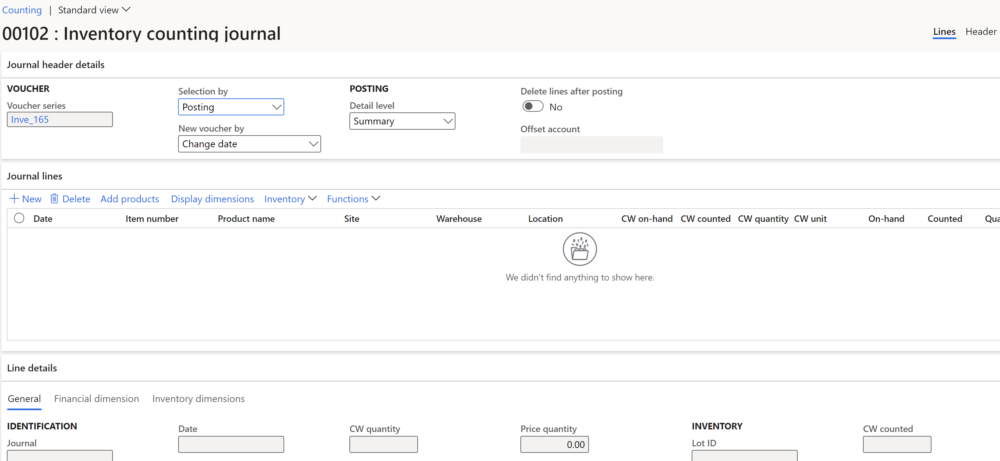

---
lab:
  title: Лабораторная работа 3. Создание инвентарного журнала
  module: 'Module 3: Learn the Fundamentals of Microsoft Dynamics 365 Supply Chain Management'
---

# Модуль 3. Изучение основ Microsoft Dynamics 365 Supply Chain Management

## Лабораторная работа 3. Создание инвентарного журнала

## Исходные условия выполнения лабораторной работы

   - **Примерное время**: 10 мин

## Инструкции

1.  На домашней странице **Finance and Operations** в правом верхнем углу убедитесь, что вы работаете с компанией **USMF** . При необходимости выберите компанию и в раскрывающемся списке выберите **USMF**. 

2.  В левой области навигации в модуле **Управление запасами** >  выберите **Записи журнала****Подсчет** > **элементов.** 

3.  Нажмите кнопку **+ Создать** в области действий. Откроется диалоговое окно **Создание журнала инвентаризации** . Нажмите кнопку **ОК**. 

4.  Появится форма **журнала подсчета запасов** с информацией о заголовке и строке. 

    

5.  В области действий выберите **Создать строки —&gt; Под рукой**. 

6.  В области диалогового окна **Создание журнала подсчета под рукой** задайте для полей **Склад**, **Состояние инвентаризации**, **Расположение** и **Номерной знак** значение **Да**. 

    

7.  Разверните раздел **Записи для включения** и нажмите кнопку **Фильтр** . В поле **Номер элемента** введите `A0001` в поле **Условия** и нажмите **кнопку ОК**. 

8.  Нажмите **кнопку ОК** в нижней части диалогового окна **Создание журнала подсчета под рукой** . 

    Количество элементов **A0001** будет отображаться в сетке **Строк журнала** с разделением сайта, склада и расположения. 

9.  В столбце **Counted (Подсчитано** ) в разделе **Строка журнала** совпадите числа, подсчитаемые для каждого сайта или хранилища и расположения. Следует отметить следующее. 

    - Если имеющееся **в наличии** количество совпадет с количеством **фактического остатка**, поле **Количество** будет пустым. 

    - Если значение поля **Фактический остаток** будет больше, чем значение поля **В наличии**, поле **Количество** будет содержать положительное значение. 

    - Если значение поля **Фактический остаток** будет меньше, чем значение поля **В наличии**, поле **Количество** будет содержать отрицательное значение. 

10. Измените год поля **Дата** в каждой строке на 2022. 

11. Нажмите кнопку **Проверить** в области действий и нажмите **кнопку ОК** в области диалогового окна. 

12. Нажмите кнопку **Опубликовать** . 

13. **Закройте** страницу и вернитесь на домашнюю страницу. 

